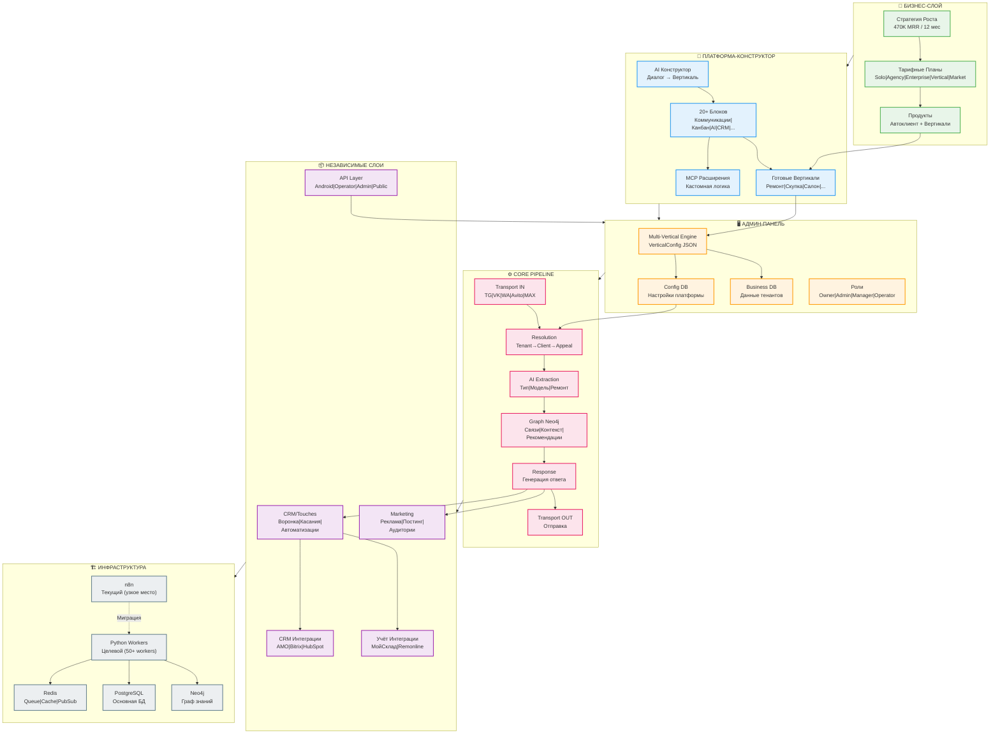
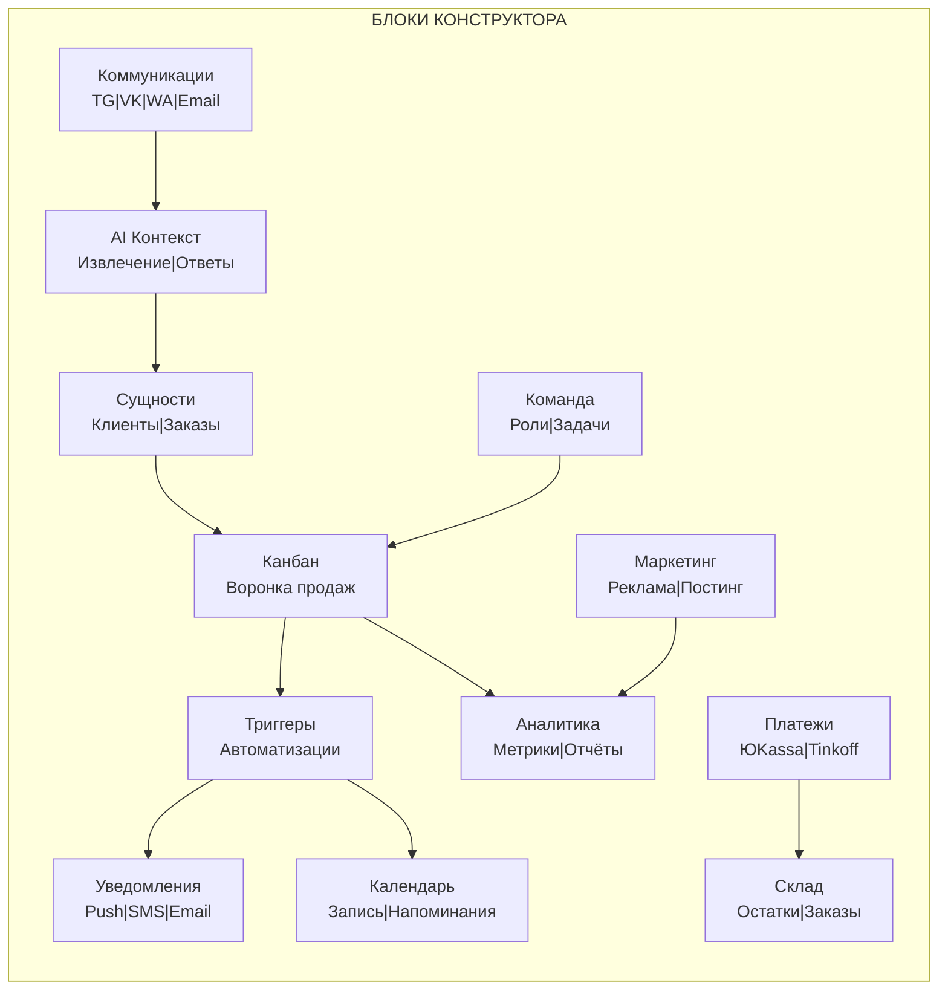
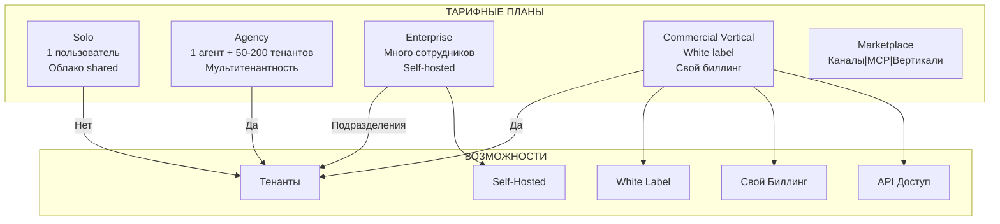
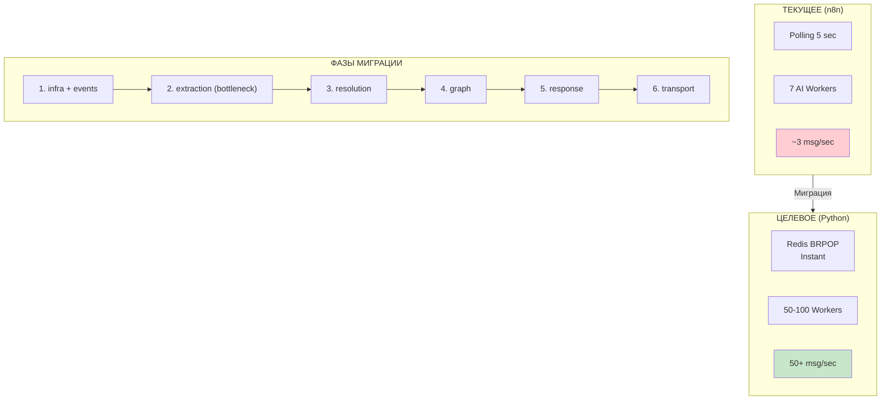

# Eldoleado — Навигационный Граф Проекта

> **Как использовать:** Этот файл — карта проекта. Задавай вопросы типа "где мы с X?" или "как связан Y с Z?" и получай быстрый контекст.

---

## RAG Поиск (Новое!)

**MCP Docs RAG** — семантический поиск по всей документации с интеграцией в Knowledge Base.

```bash
# Запуск
cd MCP/mcp-docs-rag && docker-compose up -d

# Поиск
curl "http://localhost:8090/mcp/ask?query=как работает обработка сообщений"

# Контекст с графом связей
curl -X POST http://localhost:8090/context -d '{"topic": "воронка продаж"}'
```

**Что ищет:**
- 📄 Документы Plans/*.md (семантический поиск)
- 🔧 Компоненты KB (workflows, tables, API)
- 🔗 Связи между компонентами (граф)
- 📊 Ноды workflow (детали реализации)

---

## Быстрая Навигация

| Область | Статус | Документ |
|---------|--------|----------|
| Бизнес-стратегия | 📋 План | [Стратегия_Роста.md](Стратегия_Роста.md) |
| Тарифы | 📋 Концепт | [Тарифы_Ценообразование.md](Тарифы_Ценообразование.md) |
| AI Конструктор | 📋 Видение | [Видение_AI_Конструктора.md](Видение_AI_Конструктора.md) |
| Блоки платформы | 📋 Архитектура | [Блочная_Архитектура.md](Блочная_Архитектура.md) |
| Админка | 📋 Спецификация | [Админка_Спецификация.md](Админка_Спецификация.md) |
| AI Система | 📋 Архитектура | [Архитектура_AI_Системы.md](Архитектура_AI_Системы.md) |
| Граф Neo4j | 📋 Спецификация | [Eldoleado_Спецификация_Графа.md](Eldoleado_Спецификация_Графа.md) |
| Python миграция | 📋 План | [Миграция_на_Python_Архитектура.md](Миграция_на_Python_Архитектура.md) |
| MCP разработка | 📋 Процесс | [MCP_Процесс_Разработки.md](MCP_Процесс_Разработки.md) |
| Автоклиент | 📋 Вертикаль | [Вертикаль_Автолид.md](Вертикаль_Автолид.md) |
| Мультичат | 📋 ТЗ | [Eldoleado_Мультичат_ТЗ_v2.md](Eldoleado_Мультичат_ТЗ_v2.md) |
| Масштабирование | 📋 Анализ | [Масштаб_и_стабильность.md](Масштаб_и_стабильность.md) |

---

## Главный Граф Проекта



---

## Детальные Связи Блоков



---

## Тарифные Планы и Возможности



---

## Core Pipeline (Обработка сообщений)

```mermaid
flowchart LR
    subgraph INPUT["ВХОД"]
        TG["Telegram"]
        VK["VK"]
        WA["WhatsApp"]
        AVITO["Avito"]
        MAX["MAX"]
    end

    subgraph PIPELINE["PIPELINE"]
        P1["1. Transport IN<br/>Unified Format"]
        P2["2. Resolution<br/>Tenant→Client→Appeal"]
        P3["3. AI Extraction<br/>Тип|Модель|Ремонт|Запчасть"]
        P4["4. Graph Query<br/>История|Похожие|Cross-sell"]
        P5["5. Response Gen<br/>Ответ + Действие"]
        P6["6. Transport OUT<br/>Отправка"]
    end

    subgraph OUTPUT["ВЫХОД"]
        AUTO["Auto Response"]
        OPERATOR["→ Оператор"]
    end

    INPUT --> P1 --> P2 --> P3 --> P4 --> P5 --> P6 --> OUTPUT

    style P3 fill:#ffcdd2
    style P4 fill:#c8e6c9
```



---

## Миграция n8n → Python



---

## Статусы Реализации

| Компонент | Статус | Приоритет | Блокеры |
|-----------|--------|-----------|---------|
| MCP Telegram | ✅ Работает | - | - |
| MCP VK | ✅ Работает | - | - |
| MCP WhatsApp | ✅ Работает | - | - |
| MCP Avito | ✅ Работает | - | - |
| MCP MAX | 🔄 В работе | Высокий | API доступ |
| n8n Workflows | ✅ Работает | - | Масштаб |
| Android App | ✅ MVP | Средний | - |
| AI Extraction | ✅ Работает | - | Скорость |
| Neo4j Graph | 📋 Планируется | Средний | - |
| Python Workers | 📋 Планируется | Критично | - |
| Админ-панель | 📋 Планируется | Высокий | - |
| AI Конструктор | 📋 Концепт | Низкий | Админка |

---

## Ключевые Метрики

```
Целевая нагрузка:
├── Клиентов: 1000
├── Диалогов/клиент: 30
├── Сообщений/диалог: 40
├── Сообщений всего: 1,200,000 / 10 часов
├── Среднее: 33 msg/sec
└── Peak: 100-170 msg/sec

Текущее:
├── n8n: ~3 msg/sec
└── Дефицит: 10-50x
```

---

## Как задавать вопросы

**Примеры вопросов и где искать ответы:**

| Вопрос | Смотри в |
|--------|----------|
| "Как работает обработка сообщений?" | Core Pipeline, [Миграция_на_Python_Архитектура.md](Миграция_на_Python_Архитектура.md) |
| "Какие блоки есть в конструкторе?" | [Видение_AI_Конструктора.md](Видение_AI_Конструктора.md), [Блочная_Архитектура.md](Блочная_Архитектура.md) |
| "Как устроена мультитенантность?" | [Тарифы_Ценообразование.md](Тарифы_Ценообразование.md), [Админка_Спецификация.md](Админка_Спецификация.md) |
| "Что такое вертикаль?" | [Видение_AI_Конструктора.md](Видение_AI_Конструктора.md), [Вертикаль_Автолид.md](Вертикаль_Автолид.md) |
| "Как масштабировать систему?" | [Масштаб_и_стабильность.md](Масштаб_и_стабильность.md), [Миграция_на_Python_Архитектура.md](Миграция_на_Python_Архитектура.md) |
| "Как разрабатывать MCP?" | [MCP_Процесс_Разработки.md](MCP_Процесс_Разработки.md) |
| "Какой план монетизации?" | [Стратегия_Роста.md](Стратегия_Роста.md), [Тарифы_Ценообразование.md](Тарифы_Ценообразование.md) |

---

## Обновление графа

При изменениях в проекте:
1. Обнови соответствующий документ в `Plans/`
2. Обнови таблицу "Статусы Реализации" выше
3. При структурных изменениях — обнови Mermaid диаграммы

---

*Последнее обновление: декабрь 2025*
